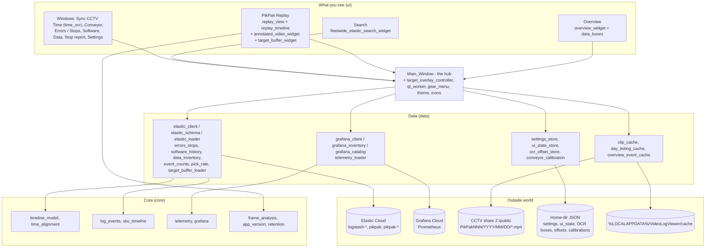

# The Logfather — architecture

A PySide6/OpenCV desktop app that plays CCTV clips of Leap PikPak robots
side-by-side with their Elastic logs, frame-aligned by reading the camera's
burnt-in clock, with an Overview of every PikPak, a fleet Search, and windows
for errors and stops, software versions and data volumes.

Rewritten 2026-09-14 for the package layout and the module names that match
the screens. The in-app About page (gear → About) shows the same schematic,
a screen-to-module map, and the file table below. The file table is
generated from the About page's list by `tools/gen_architecture_table.py`;
edit `FILE_GROUPS` in `src/logfather/ui/about_page.py`, then run the tool.

The current review and refactoring plan is `docs/CODE_REVIEW_2026-09-14.md`.

## The layers

```
src/Main_Window.py            the 21-line entry shim (run command, shortcut, PyInstaller)
src/logfather/
    paths.py                  package / src / repo roots
    core/                     pure logic: models and maths, no Qt, no network
    data/                     Elastic, Grafana, caches, stores; QtCore signals allowed, no GUI
    ui/                       everything Qt: the hub, the screens, the windows, the shared widgets
tools/                        smoke test, connection checks, standalone scripts
tests/                        pytest over the pure logic (312 tests)
```

The layering rule: `ui` may import `data` and `core`; `data` may import
`core`; never the reverse. The smoke test imports every module in that
order, so a slip fails on the lowest layer that has it.

## The big picture

`ui/Main_Window.py` is the hub. It stacks the three modes — **Overview**
(`overview_widget.py`), **PikPak Replay** (`replay_view.py` with the
`replay_timeline.py` chart under it) and **Search**
(`fleetwide_elastic_search_widget.py`) — and owns the top bar: the PikPak and
date choosers, the first-product button, the Drift slider, Sync, Conveyor,
Track, Targets, Data, Errors / Stops, Software and the gear menu. Pick a
PikPak and a day → the timeline lists that day's clips and event marks →
click a clip → the replay plays it with the logs alongside → as the playhead
moves, the Targets panel and the product overlays follow.

All Elastic access goes through `data/elastic_loader.py` on top of
`data/elastic_client.py` (HTTP, pagination) and `data/elastic_schema.py`
(the Argus 1 vs Argus 2 schema). All Grafana access goes through
`data/grafana_client.py`. Everything the app remembers lives in
`data/settings_store.py` (secrets included, in the home directory) and
`data/ui_state_store.py`.



## Where each screen lives

| On screen | Code |
|---|---|
| Overview | `ui/overview_widget.py`, the Data and Additional data boxes in `ui/data_boxes.py` |
| PikPak Replay | `ui/replay_view.py` (video, logs, filters, OCR offsets, Sync and Overlay tool strips, Analysis, annotations, Bird's Eye, export), `ui/replay_timeline.py` (the chart: clips, event ticks, SKU bands, Errors box rows, playhead, View menu, zoom), `ui/annotated_video_widget.py` (the canvas), `ui/target_buffer_widget.py` (Targets) |
| Search | `ui/fleetwide_elastic_search_widget.py` |
| Sync CCTV Time | `ui/time_ocr.py` — `SyncCctvTimeWindow` and the OCR engine (date procedure A-H, second-boundary search, readings table with 60 s drift checks) |
| Conveyor | `ui/conveyor_calibration_dialog.py`, `data/conveyor_calibration.py` |
| Track, Targets, first product | `ui/target_overlay_controller.py` |
| Errors / Stops | `ui/errors_stops_window.py`, `data/errors_stops.py` |
| Software | `ui/software_window.py`, `data/software_history.py` |
| Data (+ the two ? catalogues) | `ui/data_inventory_dialog.py`, `data/data_inventory.py`, `ui/elastic_catalog_dialog.py`, `ui/grafana_catalog_dialog.py` |
| Stop report | `ui/stop_report.py` |
| Settings, Data sources | `ui/settings_dialog.py`, `ui/data_sources_dialog.py`, `data/settings_store.py` |
| Top-bar buttons | `Main_Window.py`: `replay_btn`, `overview_btn`, `search_btn`, `first_product_btn`, `conveyor_btn`, `track_toggle`, `targets_toggle`, `data_btn`, `errors_stops_btn`, `software_btn`, `refresh_btn`; the Drift tool and Sync button are `ReplayView.drift_tool` / `video_sync_btn` |

## What each file does

<!-- FILE TABLE: generated by tools/gen_architecture_table.py - do not edit by hand -->

### Entry

How the program starts.

| File | Lines | Purpose |
|---|---:|---|
| `src/Main_Window.py` | 21 | The 21-line entry shim: puts src/ on the path and hands over to logfather.ui.app_main. Keeps the run command, the desktop shortcut and the PyInstaller specs working. |
| `logfather/paths.py` | 19 | The three folder anchors (package, src, repo) and the bundle root in a frozen build. |
| `ui/app_main.py` | 300 | Application start-up: the fade-in splash, single-instance guard, start-up geometry, and the desktop shortcut renamed to the running version. |

### Core - pure logic, no Qt and no network

Models and maths that everything else builds on. All unit-tested.

| File | Lines | Purpose |
|---|---:|---|
| `core/timeline_model.py` | 194 | The TimelineItem (a clip or an event on the day) plus the day, clip-name and timezone helpers and the clip-cache index. |
| `core/time_alignment.py` | 102 | The three-timeline maths in one dataclass: video seconds, log-event seconds and the camera's wall clock, including the OCR correction and the plausibility limit on offsets. |
| `core/log_events.py` | 106 | Turns fetched Elastic rows into the LogEvent list the replay plays against. |
| `core/sku_timeline.py` | 136 | The SKU and manual-mode band state machine behind the Overview rows. |
| `core/telemetry.py` | 404 | Which Prometheus metrics the app shows (temperatures, currents, pressure, picks) and how their series become tracks, groups and summaries. |
| `core/grafana.py` | 274 | Pure parsing of Grafana dashboard JSON: panels, queries, template variables, frames to series. |
| `core/frame_analysis.py` | 161 | Pixel-difference and optical-flow views for the replay's Analysis tab (numpy and OpenCV only). |
| `core/app_version.py` | 129 | Which build is running (version.json or git), and the check for a newer commit on GitHub. |
| `core/retention.py` | 17 | The 30-day CCTV retention rule and the 'footage deleted' notice. |

### Data - Elastic, Grafana, caches and stores

Everything that talks to a server or a file. No GUI imports.

| File | Lines | Purpose |
|---|---:|---|
| `data/elastic_client.py` | 241 | Shared HTTP plumbing for Elastic: sessions, URLs, headers, the search_after pagination and retry ladder. |
| `data/elastic_schema.py` | 220 | The one place that knows the Argus 1 vs Argus 2 log schema: robot ids (leap_robot_id / system_id), state names, what counts as manual, automatic, shutdown or a stop. |
| `data/elastic_loader.py` | 1706 | The gateway to Elastic: the query builders, the day events fetch with its on-disk cache (past days never expire; bump EVENTS_CACHE_SCHEMA_VERSION when the logic changes), SKU items, raw logs for a clip, the Overview chunks and the Search histograms. |
| `data/elastic_errors.py` | 10 | One exception that carries the rows a half-failed query did manage to fetch. |
| `data/errors_stops.py` | 304 | Errors and line stops per day per PikPak: stop kinds, error categories, and the 2-second clustering. |
| `data/software_history.py` | 372 | Package and commit history per PikPak, built into version spans, with a local raw cache. |
| `data/data_inventory.py` | 894 | The Data window's numbers: Elastic volume per day, running days, CCTV clips on the share, with a cache. |
| `data/elastic_catalog.py` | 344 | What kinds of documents Elastic holds, and the values a field takes - the Elastic ? catalogue. |
| `data/event_counts.py` | 85 | Running totals of a logged event per PikPak (Motor overcurrent trips, crate change errors) as strips. |
| `data/pick_rate.py` | 94 | Picks per minute from Elastic for PikPaks that Grafana does not cover. |
| `data/target_buffer_loader.py` | 305 | Replays the 'new pick target' log messages to rebuild the robot's pick queue at any instant of a clip. |
| `data/grafana_client.py` | 150 | The Grafana HTTP client (service-account token): health, dashboards, Prometheus queries. |
| `data/grafana_inventory.py` | 156 | How much telemetry Grafana holds per PikPak per day. |
| `data/grafana_catalog.py` | 186 | What metrics Grafana holds and what each looks like - the Grafana ? catalogue. |
| `data/telemetry_loader.py` | 97 | The six PromQL queries for one PikPak-day, and the fleet signals for the Data strips (routing the Elastic-derived ones to pick_rate and event_counts). |
| `data/clip_cache.py` | 451 | The local CCTV clip cache: copies from the share, prefetches the next clips, prunes by age and size. |
| `data/day_listing_cache.py` | 82 | Caches each past day's clip listing so the share is not walked twice. |
| `data/overview_event_cache.py` | 158 | Today's raw Overview events on disk, so a restart fetches only the tail. |
| `data/settings_store.py` | 523 | Everything the app remembers: video root, Elastic and Grafana connection, the 15 condition presets, customers and PikPak layout, fleetwide searches - saved to ~/.cctv_picker_settings.json. |
| `data/ui_state_store.py` | 76 | Per-user window state (ticks, collapsed boxes, hidden systems) kept out of Settings so a stale instance cannot clobber it. |
| `data/ocr_offset_store.py` | 104 | The per-camera JSON of OCR clock offsets: atomic writes, corrupt files set aside rather than replaced. |
| `data/conveyor_calibration.py` | 143 | The belt model: the tracking line and its speed per PikPak, saved under ~/.logfather/calibrations. |

### UI - the hub and the shared pieces

The main window that wires every screen together, and the helpers they share.

| File | Lines | Purpose |
|---|---:|---|
| `ui/Main_Window.py` | 2126 | The hub: builds the Overview / PikPak Replay / Search stack, the top bar (PikPak and date choosers, first-product, Drift, Sync, Conveyor, Track, Targets, Data, Errors / Stops, Software, gear), the date picker and timeline splitters, session resume, clip opening and prefetch, and the jump from the Overview to a moment in a clip. |
| `ui/target_overlay_controller.py` | 419 | Loads the clip's pick-queue events, classifies tight and wide gaps, owns the conveyor calibration and the Conveyor dialog, and builds the product overlays the Track button draws. |
| `ui/qt_worker.py` | 165 | The one background-job pattern (Job on a QThread, JobSlot to retire stale results) used by every loader. |
| `ui/gear_menu.py` | 96 | The gear dropdown shared by the windows: Data sources, Settings, Stop report, Fit, zoom, About. |
| `ui/day_selection.py` | 30 | The one shared day range that the Overview, Errors / Stops and Data windows follow together. |
| `ui/day_range_dialog.py` | 157 | The From / To day picker with presets. |
| `ui/day_popup.py` | 106 | The single-day calendar popup behind the top bar's date button. |
| `ui/Date_Picker_frontend.py` | 451 | The left panel: PikPak buttons grouped by customer with logos, and a calendar of days with footage. |
| `ui/system_filter.py` | 195 | The PikPaks filter popup (tick many) and the PikPak picker (choose one). |
| `ui/charts.py` | 600 | The stacked per-day bar chart with hover detail used by Errors / Stops and Data. |
| `ui/chart_scroll.py` | 153 | One scrollbar and zoom shared by several day charts, with an edge signal to load more days. |
| `ui/theme.py` | 496 | Every colour token and stylesheet, the app zoom, and the one place a restyle should happen. |
| `ui/icons.py` | 460 | The painted icons (no image files): gear, calendar, conveyor, punnet, sync, first product, question block... |
| `ui/pulse.py` | 66 | The gentle breathing highlight on a button that needs attention (Sync: ?). |
| `ui/window_placement.py` | 67 | Keeps secondary windows on screen and over their parent. |
| `ui/app_assets.py` | 39 | Finds bundled assets (logo, diagram, placeholder) in a source checkout or a frozen build. |
| `ui/about_page.py` | 436 | This dialog: the version linked to its GitHub commit, the schematic, and these summaries. |

### UI - the screens and windows

One module per thing you can open.

| File | Lines | Purpose |
|---|---:|---|
| `ui/overview_widget.py` | 2413 | The Overview: one row per PikPak drawn on a graphics scene (SKU runs, manual, stops, CCTV coverage), the day range, the PikPaks filter, drag to reorder, hover thumbnails, and the incremental refresh with its on-disk cache. |
| `ui/data_boxes.py` | 790 | The Data and Additional data boxes and their reading strips (a SignalChannel per Grafana or Elastic reading), shared by the Overview and the PikPak Replay timeline. |
| `ui/replay_view.py` | 4556 | The PikPak Replay: video playback with the log list, the Elastic log load, the OCR offset applied to the main and the Additional CCTV, the Sync and Overlay tool strips, the Analysis tab, annotations, Bird's Eye, and export with overlays burnt in. |
| `ui/log_filter_panel.py` | 956 | The replay's Filters and Custom tabs: the source / state / message checkbox columns, the 15 filter presets, the five custom filter-in / filter-out blocks, their Settings persistence, and the row matching the log list is filtered by. |
| `ui/replay_timeline.py` | 1927 | The timeline chart under the replay: the day's clips, event ticks, SKU bands, the Errors box rows, the label gutter, the playhead, the View menu, zoom and the Data strips. |
| `ui/annotated_video_widget.py` | 925 | The video canvas: the frame, drawing and measuring annotations, the info text, the product overlays and the Bird's Eye tray view. |
| `ui/viewer_widgets.py` | 489 | Small replay widgets: the seek and clip-range sliders, the marker bars, the log list model, the drift slider. |
| `ui/target_buffer_widget.py` | 397 | The Targets panel: one card per product in the robot's queue, updating as the clip plays. |
| `ui/telemetry_strip.py` | 204 | The Telemetry tab in the replay: the day's Grafana tracks in groups. |
| `ui/time_ocr.py` | 2593 | The Sync CCTV Time window and the OCR engine behind it: the draggable Date and Time boxes, the date procedure A-H, the second-boundary search, the readings table with its 60 s drift checks, the help flowchart, and the headless analysis the automatic sync runs. |
| `ui/conveyor_calibration_dialog.py` | 857 | The Conveyor window: click the same belt landmark on two frames to set the tracking line and speed. |
| `ui/fleetwide_elastic_search_widget.py` | 769 | The Search screen: saved searches over every PikPak for a day range, cards and graphs per system. |
| `ui/errors_stops_window.py` | 618 | The Errors / Stops window: stops per day and errors per day by category, with the PikPaks filter. |
| `ui/software_window.py` | 288 | The Software window: version spans per PikPak on a timeline. |
| `ui/data_inventory_dialog.py` | 1087 | The Data window: Elastic, Grafana and CCTV volume per PikPak per day, and the two ? buttons. |
| `ui/elastic_catalog_dialog.py` | 265 | The Elastic ? catalogue window and the field-values drill-down. |
| `ui/grafana_catalog_dialog.py` | 204 | The Grafana ? catalogue window and the metric detail. |
| `ui/data_sources_dialog.py` | 200 | Data sources: the CCTV share, Elastic and Grafana connections, each with a test button. |
| `ui/settings_dialog.py` | 450 | The Settings tabs inside the replay: connection, the condition presets, the customer/PikPak layout, and the read-me. |
| `ui/stop_report.py` | 590 | The Stop report: gathers the day's stops off the GUI thread, then builds the thumbnailed list. |

### Tools and tests

Outside the app.

| File | Lines | Purpose |
|---|---:|---|
| `tools/smoke_test.py` | 79 | The after-every-edit check: imports every module under logfather and builds the main window offscreen. |
| `tools/elastic_api_check.py` | 65 | Proves the Elastic connection works with the app's own settings. |
| `tools/elastic_volume_check.py` | 139 | Elastic volume per day and per machine for the last 30 days. |
| `tools/grafana_check.py` | 86 | Grafana version, org, datasources and one dashboard's queries. |
| `tools/elastic-log-download.py` | 302 | Standalone CSV download of a robot's logs through Kibana Reporting (API key from the environment). |
| `tools/Vid_Frame_Differencing.py` | 685 | The original motion-analysis prototype; its maths now lives in core/frame_analysis.py. |
| `tools/logs_to_srt.py` | 155 | Legacy: a CSV log export turned into subtitles. Superseded by the replay. |
| `tests/` | 3806 (all) | 26 pytest modules over the pure logic: parsing, caches, alignment, the OCR engine, errors and stops, telemetry, Grafana, software history, the offset store. |
| `build.ps1 + spec/iss` | 124 | The release pipeline: stamp version.json, PyInstaller-bundle The Logfather, build the installer. |

<!-- END FILE TABLE -->

## Key flows

**Open a clip (the hot path).** DatePicker `date_selected` → MainWindow →
`ReplayTimeline.show_times` (worker thread: list clips from filenames, then
Elastic condition and SKU items appended as they arrive) → click a block →
`time_selected` → `ReplayView.load_video_from_path` (the clip is copied from
the share to the local cache first, then opened with OpenCV) → the logs for
the clip window are fetched on a worker → the cached OCR offset is applied,
or the Sync CCTV Time procedure runs → the log list highlights in step with
playback.

**Time alignment.** Three offsets stack: the filename time
(`YYYYMMDDHHMMSS`, local) + the OCR correction (seconds plus a frame nudge,
cached per clip in `ocr_offset_store`, rejected when implausible) + the
Drift slider. `core/time_alignment.TimeAlignment` holds the maths; the
replay's `alignment` property snapshots it. A timeline click and the
first-product button seek through the OCR-corrected clock, the filename
time being the fallback.

**Sync CCTV Time.** A. use the Date and Time boxes as placed; B. read the
date on frame 1; C. if it matches the filename date skip to F; D. scan for
the frame where the date changes; E. show it, green or red against the
filename date; F. the clock checks (coarse scan every 0.2 s, bisection to
the second boundary, verify at the middle of the clip), then the readings
table (every second change in the first 10 s, then one drift check every
60 s); G. a moved box waits two seconds and reruns from A; H. the boxes are
stored per camera (the Additional CCTV under its own key). Every stage's
progress dialog can be cancelled.

**Playhead fan-out.** Every displayed frame emits `current_time_changed` →
timeline playhead and HH:MM label, Targets panel refresh (`buffer_state_at`
by bisect), product overlays (belt position from the calibration and the
product's age), Additional CCTV frame slaved to the main camera's clock.

**Overview.** One worker scans every PikPak's clips for the chosen days and
streams Elastic transition events for all robots at once in chunks; a
per-system state machine (`core/sku_timeline`) turns them into SKU / manual
bands and stop ticks. Today refreshes every 60 s on top of an on-disk cache
of the day's events; past days come from the events cache and never expire
(bump `EVENTS_CACHE_SCHEMA_VERSION` when the query logic or the cached
shape changes).

**Search.** Per PikPak, in parallel: one paginated query for occurrences,
one for operation-state transitions, one for the state just before the
window; each occurrence is classified "operating" or "startup / stopped".

**Background work.** Every loader is a `qt_worker.Job` on a QThread with a
`JobSlot` that retires stale results, so a clip change mid-fetch never
applies the old answer.

## External state (everything outside the repo)

| Location | Contents |
|---|---|
| `~/.cctv_picker_settings.json` | All settings including the Elastic API key and the Grafana token. Never committed. The repo's `cctv_picker_settings.json` is a colleague's export the app never reads. |
| `%USERPROFILE%/ocr_settings.json` | The Date and Time box positions per camera (`roi_by_key`, `date_roi_by_key`; the Additional CCTV under `<PikPak>/additional`). |
| `%LOCALAPPDATA%/VideoLogViewer/cache` | Local clip copies (LRU by age and size), Elastic day caches, today's Overview events, day listings, per-clip annotation JSON, OCR offset stores (`ocr_offsets*.json`), ui_state.json. The folder name predates the rename and is kept so nobody loses their cache. |
| `~/.logfather/calibrations/` | One JSON per PikPak: the conveyor tracking line. |
| `Z:/public/PikPak<NNN>/YYYY/MM/DD/*.mp4` (+ `AdditionalCCTV/`) | The CCTV footage (IONOS HiDrive share; a colleague maps it as `Y:`). 30-day retention. |
| Elastic Cloud | Index pattern `logstash-*,pikpak,pikpak-*`; the Kibana URL in settings is rewritten `.kb.` → `.es.` for queries. |
| Grafana Cloud | Prometheus datasource `grafanacloud-prom`, service-account token in settings. |
| GitHub | `chrishamblin489/logfather`; the update check compares the running commit with the remote. |

## Dead and dormant code

See `docs/CODE_REVIEW_2026-09-14.md` section 3 for the grep-verified list
(the 2026-09-02 list is mostly cleared; `TargetScopeWidget` and
`DatePicker.settings_requested` remain, plus the dormant pick-rate heat
strip and the hidden yellow log-marker bar).
